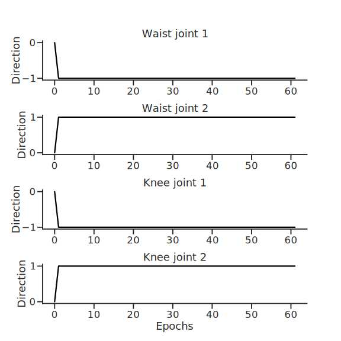
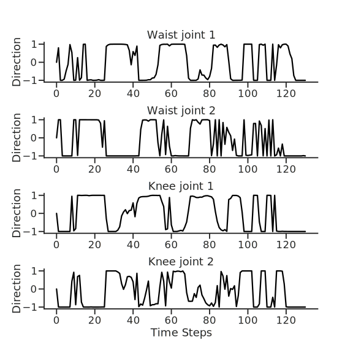
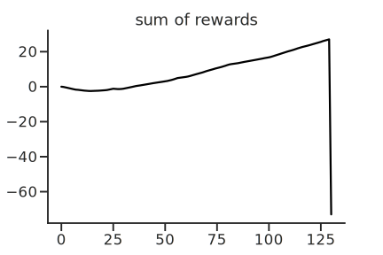
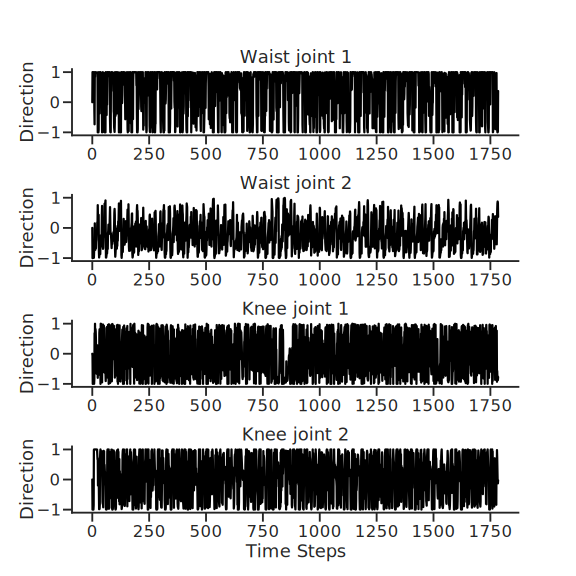
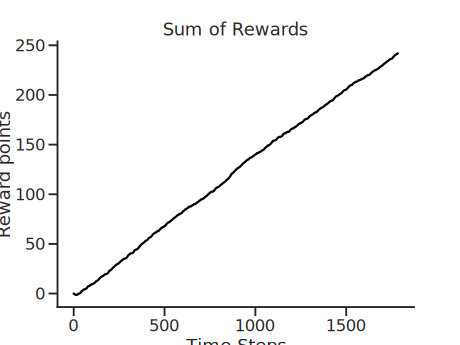

# Final project for Imbizo 2022
## Topic: Using Reinforcement learning to train a robot to walk in a simulation environment.
---
> This project makes use of the Bipedal walker from the [Box 2D environment](https://www.gymlibrary.dev/environments/box2d/), Actor-2-Critic models from [Stable Baselines 3](https://stable-baselines3.readthedocs.io/) to train a agent in learning to walk.

--- 
### Models Used
- A2C- A synchronous, deterministic variant of Asynchronous Advantage Actor Critic (A3C).
- DDPG - Deep Deterministic Policy Gradient 
- TD3- Twin Delayed DDPG (TD3) Addressing Function Approximation Error in Actor-Critic Methods.

TD3 is a direct successor of DDPG and improves it using three major tricks: clipped double Q-Learning, delayed policy update and target policy smoothing. 

---
### Training the models
> optimal parameters from [RL-Baselines 3 zoo](https://github.com/DLR-RM/rl-baselines3-zoo) are used to train the models 

### Results
> The TD3 model was able to complete the game, while the DDPG model walks but falls down. The A2C model doesn't learn.

Plots of the Joints of the A2C model

---
Plots of the actions and the reward from the DDPG agent

---
Plots of the actions and reward of the TD3 Agent.

